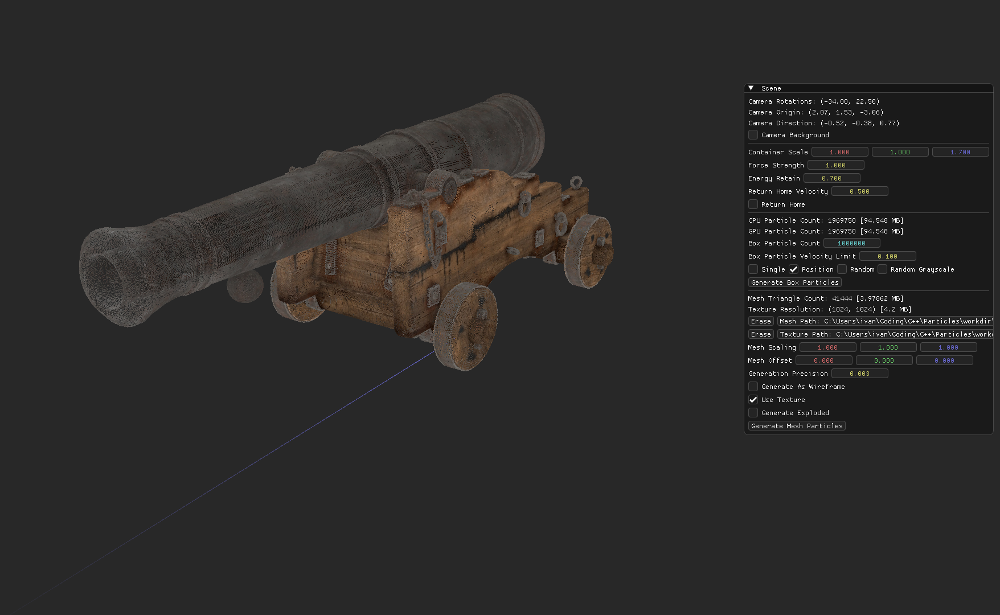
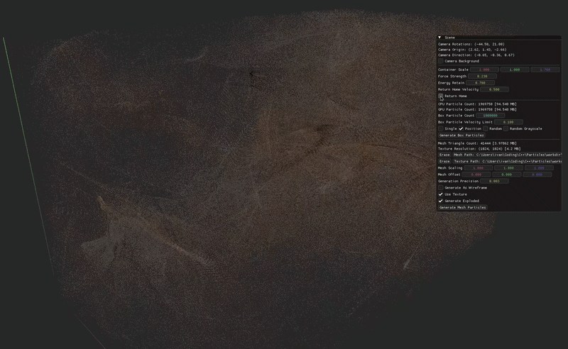
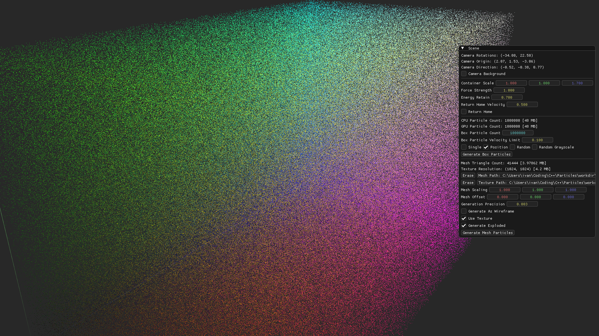

## About
3D particle simulation using Direct3D  
Supports **Model** loading *(.obj files)*  
Supports **Texture** loading *(any image file)*

## Screenshots
### Model Particles

  

  

### Box Particles

  

  

