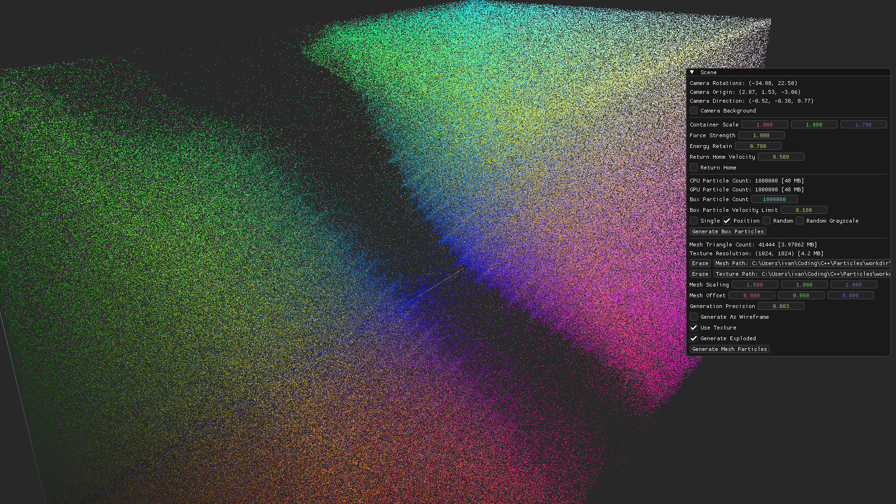

## About
3D particle simulation using Direct3D  
Supports MODEL loading *(.obj files)*  
Supports TEXTURE loading *(any image file)*

## Screenshots
### Default cube

### Loaded model (SOLID)

### Loaded model (WIREFRAME)

### Exploded model

