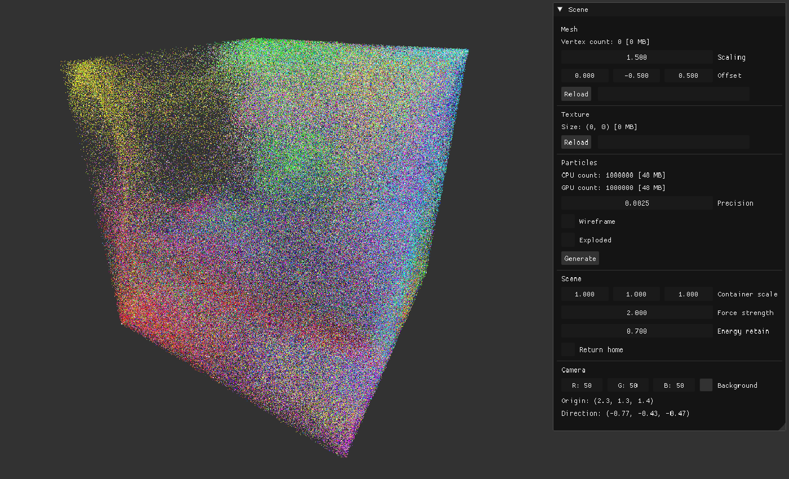
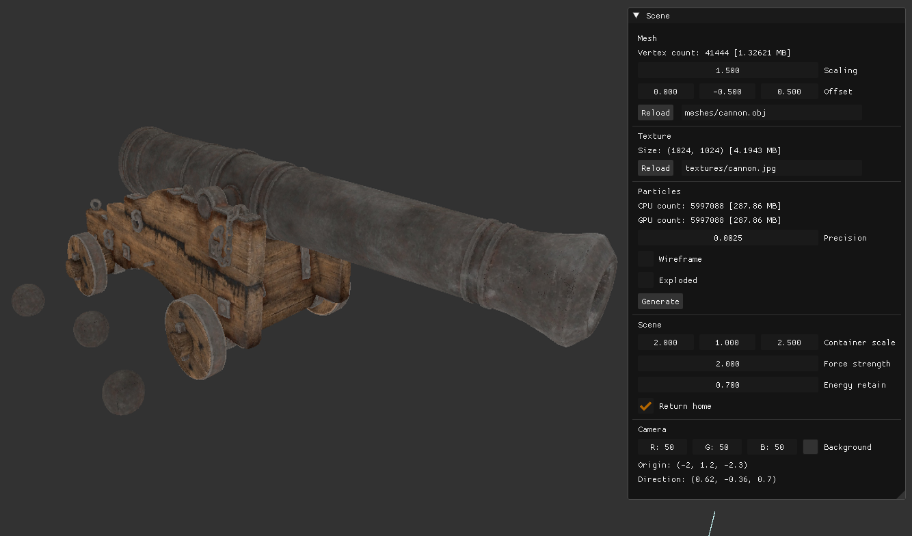
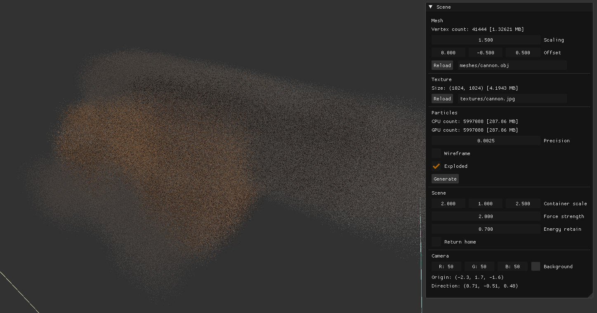

# Particles
3D particle simulation using DirectX.  
Supports MODEL loading *(.obj files)*  
Supports TEXTURE loading *(any image file)*

# Default cube

# Loaded model (SOLID)

# Loaded model (WIREFRAME)

# Exploded model

